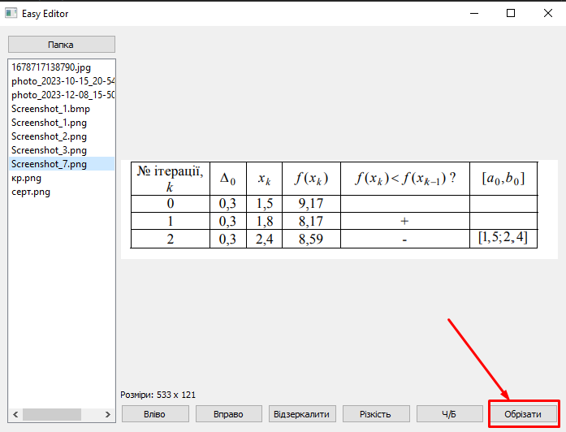
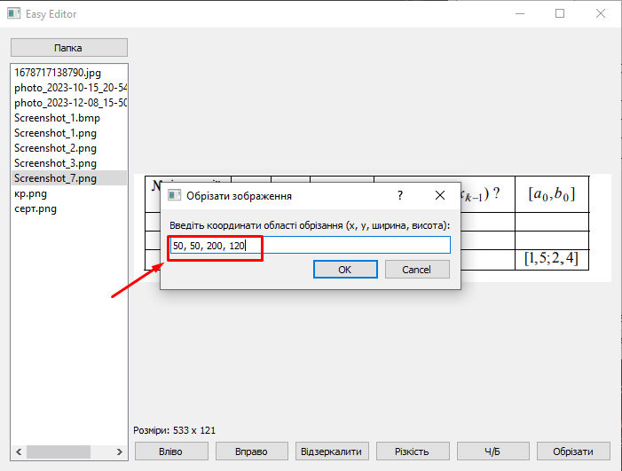
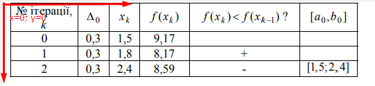
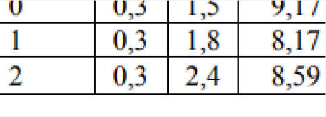

# Easy Editor

Easy Editor — це інтуїтивно зрозумілий фоторедактор, розроблений для людей похилого віку, які мають обмежений досвід користування комп'ютером. Цей додаток включається до пакету програм, створених на замовлення міністерства соціального розвитку і розроблений командою ProTeam за допомогою бібліотек PyQt5, os, та PIL.
## Встановлення

Перш ніж використовувати Easy Editor, вам потрібно встановити необхідні бібліотеки. Ви можете встановити їх за допомогою pip:

```bash
pip install PyQt5 Pillow
```

## Використання функції обрізання зображення
### Завантаження зображення
* Натисніть кнопку Папка для відкриття діалогу вибору директорії.
* Виберіть директорію, що містить зображення, які ви хочете редагувати.
* Виберіть зображення у списку, що з'явиться.
### Виконання обрізання
Натисніть кнопку Обрізати.


У діалоговому вікні введіть координати області обрізання у форматі **x, y, ширина, висота**:


x та y вказують на верхній лівий кут області обрізання.

ширина та висота вказують розміри області обрізання.
Наприклад, введення 50, 50, 200, 100 створить обрізане зображення з початком у точці (50, 50) та розмірами 200 на 100 пікселів.



Натисніть OK для застосування обрізання.
